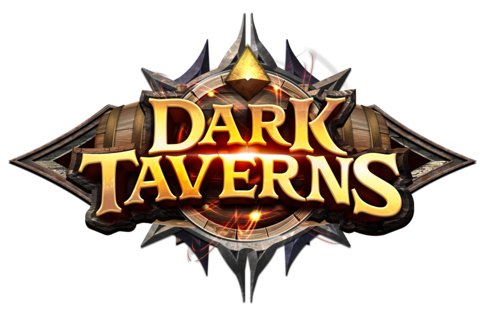
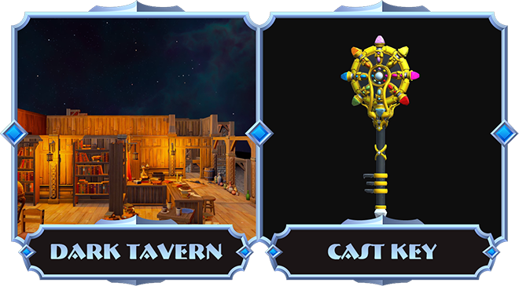
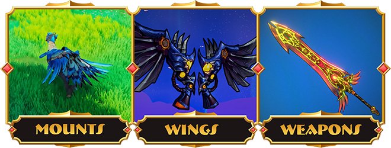

# Dark Taverns France

Ceci est un repository reprenant la traduction Française des docs, tutoriaux et récits du jeu

Toutes les illustrations et les textes de ce répertoire appartiennent à Dark Taverns.

# Bienvenue sur Dark Taverns

- MMO tour par tour
- Free-to-play
- Possédez votre propre taverne

Les fans de Zelda, Chrono Trigger et Final Fantasy auront bientôt un tout nouveau monde fantastique à explorer 
– et à posséder – comme jamais auparavant. Nous utilisons 
la technologie Web3 pour permettre aux joueurs non seulement
de posséder un terrain virtuel dans le jeu, mais aussi 
d'alimenter la magie du jeu elle-même !

## Partez affronter la nuit ! ... ou... taverne & chill ?

Combattez les ténèbres et récupérez la lumière... ou bien... 
trémoussez-vous simplement avec vos frères d'arme, en jouant au ping-pong
avec une tête d'orc à la taverne, et attendez la fin du monde ...

## C'est votre taverne... faites le nécéssaire...

Les joueurs assez audacieux pour s'aventurer au delà des 
portes de la taverne seront récompensés par une histoire 
captivante, un gameplay palpitant... et récolteront suffisamment de LOOT 
basé sur les NFT pour remplir... même le plus majestueux des sous-sols de taverne...

## Récompenses d'accès anticipé

- Tavernes
- Clés forgées

- Montures
- Ailes
- Armes

### Et recevez des items bonus supplémentaires au lancement (armures, tenues et bien plus encore !)